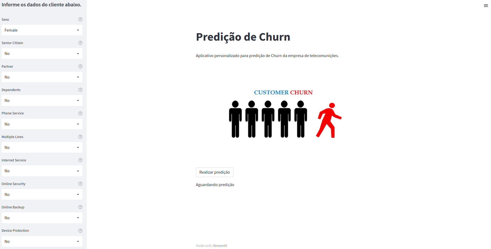

# **Churn Prediction**
Neste projeto iremos analisar dados de churn de uma empresa de telecomunições e criar modelos de machine learning para classificar possíveis clientes que possam cancelar seus planos.

Os dados utilizados neste projeto foram originalmente disponibilizados na plataforma de ensino da IBM Developer, e tratam de um problema típico de uma companhia de telecomunicações.

Apesar de não haver informações explícitas disponíves, os nomes das colunas permitem um entendimento a respeito do problema.

## **Entendendo o que é o Chur Rate**
---
**Churn rate**, ou simplesmente churn, representa a **taxa de evasão** da sua base de clientes. Em serviços como Spotify ou Netflix, ela representaria a taxa de cancelamento de assinaturas. Ela é de extrema importância para a administração e sua análise ao longo do tempo pode mostrar que existe algum problema que deve ser atacado.

Churn também pode ser usado para identificar potenciais cancelamentos, com um tempo de antecedência, e promover ações direcionadas para tentar reter tais clientes. Essa métrica deve receber atenção pelo fato de que **o Custo de Aquisição de Cliente (CAC)** é normalmente mais alto que o custo para mantê-los. Ou seja, um alto valor para o churn rate é o que não desejamos.

Entender por que os clientes abandonam o seu produto é muito importante para o **crescimento sustentável**.

### **Como fazer para calcular a sua taxa de churn?**

A taxa de churn geralmente é calculada num determinado período, seja anual, semestral ou mensal.

Por exemplo: se 1 de cada 20 clientes cancelam seu produto todo mês, isso representa que a taxa de churn para seu produto será de 5%.

Você também pode calcular a taxa de churn, que irá representar o percentual de contas que estão cancelando em comparação com a base de cliente ativos, da seguinte forma:

**Churn Rate: total de clientes cancelados / número total de clientes ativos do último mês**

[fonte](https://resultadosdigitais.com.br/marketing/o-que-e-churn/).

A taxa de churn depende de [vários fatores](https://www.exactsales.com.br/o-que-e-taxa-de-churn/), como:

- O bom relacionamento com seus clientes;
- A percepção de valor do produto que você está oferecendo;
- A autoridade e credibilidade que sua empresa tem no assunto;
- O tipo de atendimento que é prestado desde o primeiro contato.

Em sistemas complexos, avaliar todas estas variáveis é imprescindível para o sucesso da empresa. Geralmente, quando um usuário desiste de assinar um serviço é porque não vê mais valor naquele serviço oferecido por determinada empresa.

Entender e extrair informações de um conjunto extenso de dados de clientes é desafiador, e é aqui que o Machine Learning pode ajudar empresas a traçar perfis de seus clientes e identificar possíveis cancelamentos antes de acontecer.

## **Sobre os arquivos do projeto**
---
Aqui você vai encontrar três arquivos pricipais:

- **main.py** : Código fonte da interface gráfica desenvolvida para realizar o deploy do modelo com streamlit.

- **load_model.py** : Módulo que carrega os arquivos do modelo na pasta dados. Este módulo é chamado do main.py.

- **Analise_Churn_Prediction.ipynb** : Jupyter Notebook com todo os código de análise de dados e treinamento do modelo.

    

    
    

## **Deploy no streamlit.io**
---
Neste link você pode acessar o deploy do projeto online.